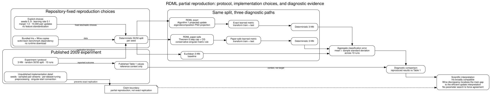

# Regularized Distance Metric Learning

A modern research-software implementation of the online **Regularized Distance Metric Learning (RDML)** algorithm introduced by Rong Jin, Shijun Wang, and Yang Zhou at NeurIPS 2009.

The repository is being modernized from its original research-prototype form into a typed, tested, reproducible Python package. The new `rdml` package is the canonical implementation. Historical root-level scripts are retained temporarily while their additional algorithms are reviewed and separated into coherent modules.

## Mathematical reference

For labelled samples \((x_i, y_i)\), the paper learns a positive semi-definite matrix \(A\) defining

\[
d_A^2(x_i, x_j) = (x_i-x_j)^\top A(x_i-x_j).
\]

For a sampled pair, define \(y_{ij}=+1\) when the labels agree and \(-1\) otherwise. With margin \(b\), Algorithm 1 considers the pair correctly classified when

\[
y_{ij}\left(b-d_A^2(x_i,x_j)\right) > 0.
\]

A violating pair receives the projected update

\[
A_t = \Pi_{S_+}\left[A_{t-1}-\lambda y_{ij}(x_i-x_j)(x_i-x_j)^\top\right].
\]

The package keeps this eigendecomposition-based update as the **exact correctness reference**.

### Paper-efficient PSD-preserving update

Theorem 6 shows that the explicit PSD projection can be avoided by choosing an adaptive learning rate. For dissimilar pairs, the full learning rate is retained. For similar pairs,

\[
\lambda_t = \min\left(\lambda,\frac{1}{\Delta x^\top A_{t-1}^{-1}\Delta x}\right),
\qquad \Delta x=x_i-x_j.
\]

The paper proposes evaluating the inverse quadratic form by solving

\[
A_{t-1}u=\Delta x
\]

with conjugate gradient, so a full eigendecomposition is not needed on every violating pair. This implementation exposes that path as `update_method="paper"` while retaining `"exact"` as the default.

For singular PSD matrices, the implementation is conservative: if the CG system is inconsistent because the pair direction contains a component in the null space, the maximum PSD-preserving subtraction step is treated as zero.

## Installation

The project uses Poetry and supports Python 3.11–3.13.

```bash
poetry install --with dev
```

## Usage

```python
import numpy as np

from rdml import RDML

X = np.array(
    [
        [0.0, 0.0],
        [0.2, 0.1],
        [2.0, 0.0],
        [2.2, 0.1],
    ]
)
y = np.array([0, 0, 1, 1])

exact = RDML(
    learning_rate=0.1,
    max_iter=1_000,
    margin=1.0,
    random_state=42,
    update_method="exact",
).fit(X, y)

paper = RDML(
    learning_rate=0.1,
    max_iter=1_000,
    margin=1.0,
    random_state=42,
    update_method="paper",
).fit(X, y)
```

`model.metric_` is the learned PSD matrix. `transform` returns coordinates in a Euclidean space whose squared Euclidean distances reproduce the learned Mahalanobis distances.

The lower-level `paper_step_size(...)` helper is also public for numerical testing and method research.

## Exact versus paper update

The two modes have different roles:

| Mode | PSD mechanism | Per-update numerical work | Intended use |
| :-- | :-- | :-- | :-- |
| `exact` | eigenvalue clipping | symmetric eigendecomposition | correctness/reference |
| `paper` | Theorem 6 step cap | matrix-vector products + CG | scalable paper-faithful update |

The paper method is not expected to be faster for every tiny dense matrix. Its advantage is asymptotic: it replaces repeated eigendecompositions with iterative matrix-vector products, which becomes more attractive as dimensionality grows and when CG converges well.

A reproducible microbenchmark is included:

```bash
PYTHONPATH=src python benchmarks/compare_projection_updates.py
```

It reports runtime, Frobenius difference from the exact projection, and the minimum eigenvalue of the paper update for dimensions 16 through 256.

## k-NN evaluation

The package includes a NumPy-only k-nearest-neighbour evaluator so learned metric spaces can be compared without adding scikit-learn as a runtime dependency.

```python
from rdml import accuracy_score, knn_predict

raw_predictions = knn_predict(X_train, y_train, X_test, n_neighbors=5)
raw_accuracy = accuracy_score(y_test, raw_predictions)

model = RDML(update_method="paper", random_state=2026).fit(X_train, y_train)
metric_predictions = knn_predict(
    model.transform(X_train),
    y_train,
    model.transform(X_test),
    n_neighbors=5,
)
metric_accuracy = accuracy_score(y_test, metric_predictions)
```

Neighbour ordering is stable. Vote ties are broken first by the smallest total squared distance among the tied labels and then by earliest neighbour rank, so repeated runs on the same arrays are deterministic.

A self-contained synthetic comparison is available with a fixed random seed and no downloads:

```bash
PYTHONPATH=src python examples/compare_knn.py
```

The script reports Euclidean 5-NN accuracy, RDML 5-NN accuracy, and their difference under the same train/test split. It is a reproducible diagnostic, not a test that RDML must outperform Euclidean distance on every problem.

## Partial reproduction of the 2009 paper

The repository now also includes a protocol-aligned partial reproduction of Experiment I on Iris and Wine. It follows the published evaluation structure: **3-NN, a random 50/50 train/test split, and 10 runs**.



The diagram separates the published protocol from repository-fixed choices and the two RDML numerical interpretations. It also makes the claim boundary explicit: published Table 1 values are comparison context, not targets to tune against.

The runtime package remains NumPy-only. The UCI benchmark uses an optional dependency group for scikit-learn's bundled dataset copies:

```bash
poetry install --with benchmark
poetry run python benchmarks/reproduce_paper_subset.py
```

The script prints reproduced Euclidean and RDML classification errors alongside the corresponding Table 1 values. Those published numbers are context, not regression targets, because the paper does not publish enough information to recreate its random seeds, sampled pair stream, and all tuning choices exactly.

The full methodological boundary and fixed implementation choices are documented in [`docs/reproduction.md`](docs/reproduction.md).

## Development

The engineering baseline is intentionally strict for the canonical package and its tests:

```bash
poetry run ruff check src tests
poetry run ruff format --check src tests
poetry run mypy src
poetry run pytest
```

CI runs these checks on Python 3.11, 3.12, and 3.13. Tests enforce at least 90% branch-aware coverage of the modern `rdml` package. The two historical root-level scripts are intentionally excluded from Ruff and pre-commit until their algorithms are reviewed and extracted; they remain preserved as legacy reference code rather than being silently reformatted or behaviourally changed.

## Modernization roadmap

1. ✅ Establish the exact projected RDML implementation as a tested mathematical reference.
2. ✅ Implement the paper's efficient PSD-preserving update and test it against the exact baseline.
3. ✅ Add deterministic k-NN evaluation helpers and a reproducible synthetic comparison.
4. ✅ Add a protocol-aligned partial reproduction on Iris and Wine.
5. Expand the reproduction to more of the original UCI datasets with explicit provenance.
6. Separate and validate the historical low-rank bilinear and OASIS-style implementations.
7. Add research documentation covering derivations, assumptions, complexity, and reproducibility.

## Reference

Rong Jin, Shijun Wang, and Yang Zhou. **Regularized Distance Metric Learning: Theory and Algorithm.** Advances in Neural Information Processing Systems 22, 2009, pp. 862–870.

Paper: https://proceedings.neurips.cc/paper/2009/hash/a666587afda6e89aec274a3657558a27-Abstract.html

## License

GNU General Public License v3.0 or later. See `LICENSE`.
